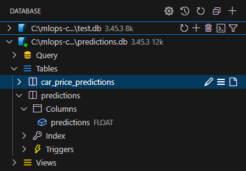
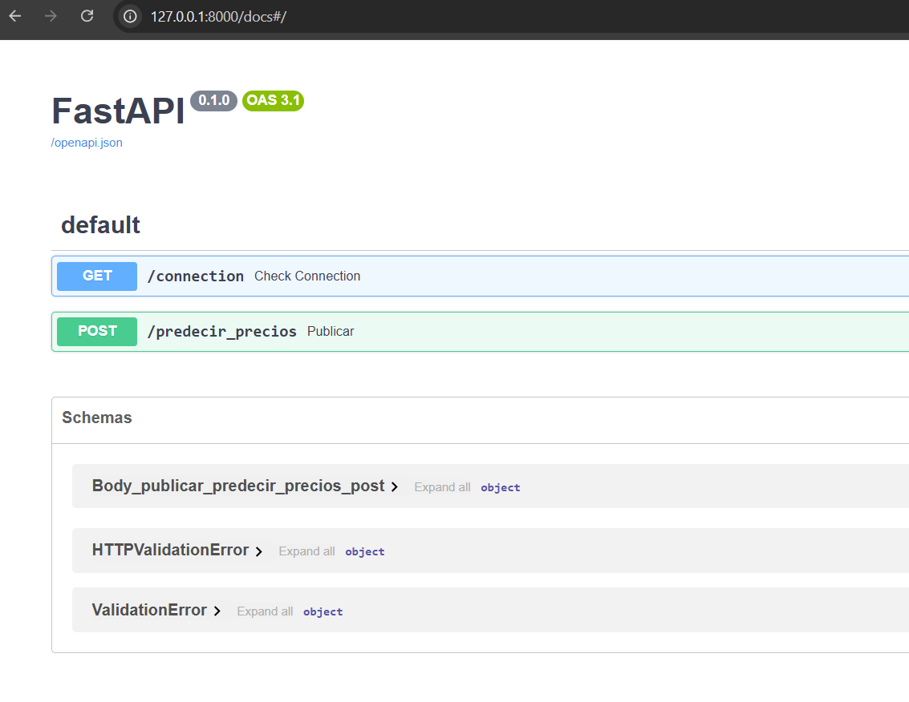
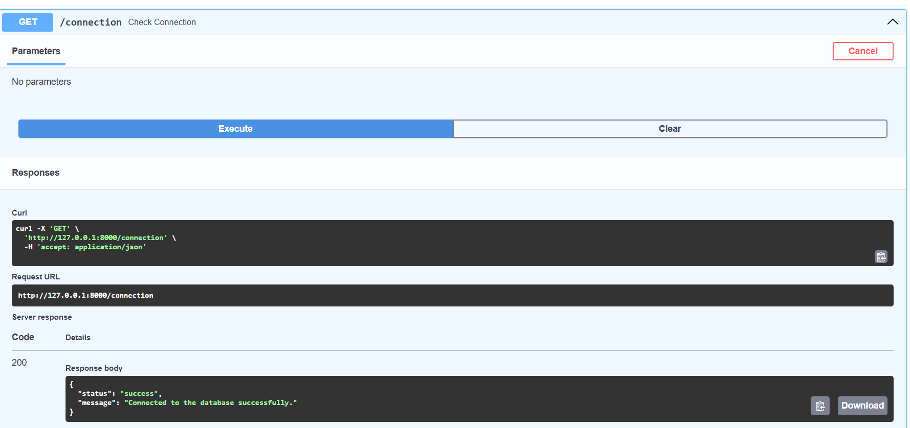
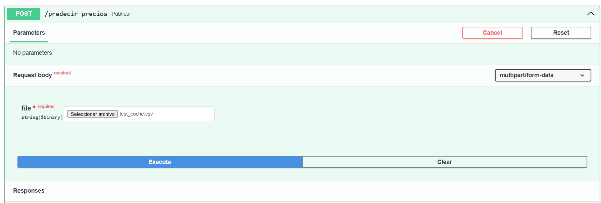
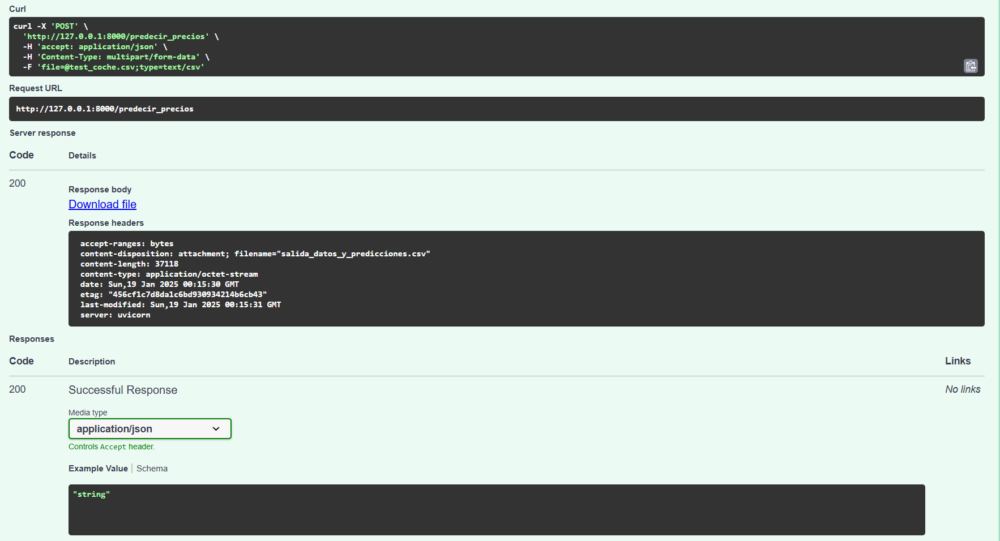
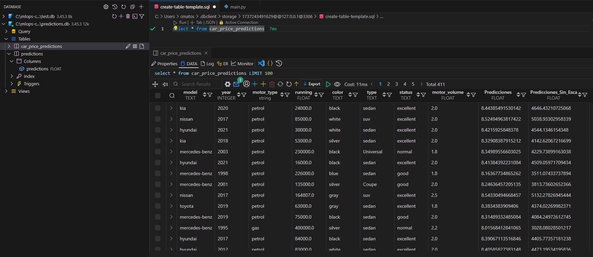

# Asignación 3 - Creación y Despliegue de una API con Base de Datos

## Configuración de BD local:
```
SQLALCHEMY_DATABASE_URL = "sqlite:///./predictions.db"
engine = create_engine(SQLALCHEMY_DATABASE_URL)
metadata = MetaData()
```



## App corriendo de forma local:



## Endpoint 1: status de conexiónde BD:




## Endpoint 2: predicción:





## Endpoint 2: predicción insertada en BD:

